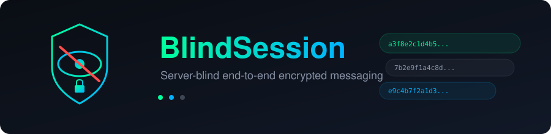

<div align="center">
  
</div>

<br/>

<p align="center">
  <strong>The server is blind. Your messages are not.</strong>
</p>

<p align="center">
  <a href="#-run-with-docker">Docker</a> &bull;
  <a href="#-features">Features</a> &bull;
  <a href="#-the-problem">The Problem</a> &bull;
  <a href="#-how-it-works">How It Works</a> &bull;
  <a href="#-tech-stack">Tech Stack</a> &bull;
  <a href="#-license">License</a>
</p>

<br/>

---

## The Problem

Every major messaging platform claims "end-to-end encryption." But ask yourself:

- **Who holds your identity keys?** Most platforms generate and store them server-side.
- **What does the server actually see?** Metadata: who you talk to, when, how often, your contact list.
- **Can the server inject new devices?** Many E2EE apps allow server-side "key change" notifications that silently add eavesdropping devices.
- **What if the server is compromised?** If the server handles key distribution, a breach can enable man-in-the-middle attacks on all future conversations.

**BlindSession solves this by making the server completely blind.**

| What the server knows | What the server doesn't know |
|-----------------------|------------------------------|
| Your public identity key hash | Your private keys |
| Ciphertext blobs | Message plaintext |
| When a message was sent | What the message says |
| That a message was delivered | Your contact list contents |
| That a message was read | Session keys or shared secrets |

The server is a **dumb relay** — it stores and forwards encrypted blobs. All key generation, key exchange, encryption, and decryption happen **in your browser** using libsodium. The server cannot read your messages, cannot inject new devices, and cannot derive your session keys even if compromised.

---

## Features

### Encryption & Identity
- **Ed25519 identity keys** — Generated in the browser, never sent to the server in plaintext
- **X25519 prekeys** — Diffie-Hellman key exchange for forward-secret session derivation
- **XChaCha20-Poly1305** — Authenticated encryption for every message
- **Signed HTTP requests** — Every API call is signed with your Ed25519 private key
- **Server-blind architecture** — The server only sees ciphertext, hashes, and signatures

### Messaging
- **Real-time delivery** — WebSocket transport with instant push
- **Offline queuing** — Messages stored as ciphertext when the recipient is offline
- **One-way contact add** — Send messages to someone before they add you back
- **Image sharing** — Auto-compressed (max 1200x1200, JPEG 0.85) with in-chat full-screen lightbox viewer

### Delivery & Read Status
- **Sent (✓)** — Message handed to the network, awaiting delivery
- **Delivered (✓)** — Recipient received the message (online push or offline queue pull)
- **Read (✓✓)** — Recipient opened and read the message
- **Per-message tracking** — Each message tracked individually, not per-contact
- **Offline persistence** — Read receipts stored server-side when the sender is offline

### Presence
- **Online / Offline** — Real-time presence via WebSocket subscriptions
- **Active in chat** — "Active in chat" badge when the recipient is viewing your conversation
- **Tab-switch aware** — Stays online when switching tabs, marks inactive in chat instead

### Disappearing Messages
- **Configurable timers** — 5 seconds, 1 minute, 1 hour, 24 hours
- **Live countdown** — Visual hourglass badge with shrinking progress bar
- **Synced to both users** — Timer changes propagate to both sender and recipient
- **Pixel-dissolve animation** — Messages evaporate with a dissolve effect on expiry

### Privacy & Control
- **Panic shredder** — One-click account deletion with prekey cleanup
- **Recovery code** — Zero-knowledge encrypted recovery blob
- **Local storage** — All message history stored in browser localStorage, encrypted at rest
- **No server-side message history** — Offline queue is deleted on delivery

---

## Run with Docker

The only requirement is [Docker](https://docs.docker.com/get-docker/). No Node.js, no PostgreSQL, no npm — Docker handles everything.

```bash
git clone https://github.com/01anonymousx10/BlindSession.git
cd BlindSession
docker compose up --build
```

Open http://localhost:3000 in your browser. That's it.

**Stop the app:**
```bash
docker compose down
```

**Stop and wipe the database:**
```bash
docker compose down -v
```

---

## Run locally (for development)

### Prerequisites
- Node.js v18+
- PostgreSQL (running locally or via Docker)

### Setup

```bash
# Install dependencies
npm install

# Configure environment
cp .env.example .env
# Edit .env with your PostgreSQL connection string

# Initialize database
psql -U postgres -d encrypted_chat_db -f database/schema.sql

# Start development server
npm run dev
```

Open http://localhost:3000 in your browser.

---

## How It Works

### Key Exchange Flow

```
┌──────────┐                    ┌──────────┐                  ┌──────────┐
│  Alice   │                    │  Server  │                  │   Bob    │
│ (browser)│                    │ (blind)  │                  │ (browser)│
└────┬─────┘                    └────┬─────┘                  └────┬─────┘
     │                               │                             │
     │ 1. Generate Ed25519 identity  │  1. Generate Ed25519 identity│
     │    + X25519 prekey in browser │     + X25519 prekey in browser│
     │                               │                             │
     │ 2. Send public keys + hash ──>│<── Send public keys + hash  │
     │    (private keys stay local)  │    (private keys stay local) │
     │                               │                             │
     │ 3. Look up Bob's public key ─>│──> Return Bob's public key  │
     │                               │                             │
     │ 4. Derive shared secret:      │                             │
     │    Alice_priv × Bob_pub       │                             │
     │    (X25519 ECDH)              │                             │
     │                               │                             │
     │ 5. Encrypt with XChaCha20 ───>│──> Forward ciphertext ────> │
     │    (server sees only blob)    │                             │
     │                               │                             │
     │                               │    6. Derive shared secret:  │
     │                               │       Bob_priv × Alice_pub   │
     │                               │       (same ECDH result)     │
     │                               │                             │
     │                               │<── 7. Decrypt with same key  │
     │                               │       → plaintext            │
```

### Why the server is blind

1. **Keys are generated in the browser** — Private keys never leave the user's device
2. **Key exchange is client-side** — The server only forwards public keys, never participates in ECDH
3. **Encryption is client-side** — The server only stores/forwards ciphertext blobs
4. **Authentication is signed** — Every HTTP request is signed with Ed25519; the server verifies but cannot forge
5. **No server-side session keys** — Shared secrets are derived independently by both clients from ECDH

---

## Tech Stack

| Layer | Technology | Purpose |
|-------|-----------|---------|
| Backend | Node.js + Fastify | HTTP API + WebSocket server |
| WebSocket | @fastify/websocket | Real-time message delivery |
| Database | PostgreSQL | User keys, offline message queue, event persistence |
| Crypto | libsodium | Ed25519, X25519, XChaCha20-Poly1305 |
| Frontend | Vanilla HTML/CSS/JS | No framework, no build step, no tracking |
| Container | Docker + Docker Compose | Zero-dependency deployment |

---

## Project Structure

```
src/
  server.js            — Server bootstrap + database auto-migration
  app.js               — Fastify app setup (routes, static files, CORS)
  crypto/
    authMiddleware.js  — Ed25519 signature verification for HTTP requests
    verify.js          — Signature verification utilities
  routes/
    auth.js            — Identity registration, prekey rotation, account deletion
    chat.js            — Message send/retrieve, chat events, read receipts
    users.js           — User lookup by identity key hash
  socket/
    connection.js      — WebSocket manager (presence, delivery, chat state, events)

config/
  db.js                — PostgreSQL connection pool

database/
  schema.sql           — Database schema (users, messages, chat_events, read_receipts)

public/
  index.html           — Full frontend (HTML + CSS)
  assets/js/
    ui.js              — UI logic, rendering, state management
    socket.js          — WebSocket client + HTTP fallback
    crypto.js          — Client-side encryption/decryption (libsodium)

assets/
  blindsession-logo.svg    — Project logo
  blindsession-banner.svg  — README banner
```

---

## License

MIT — see [LICENSE](LICENSE)
